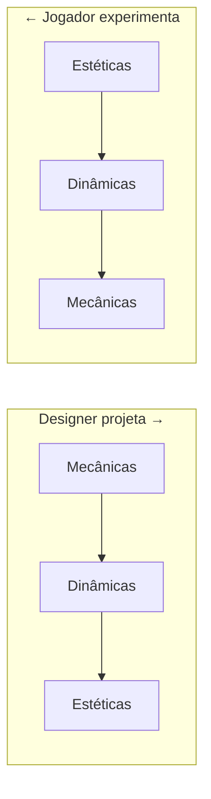
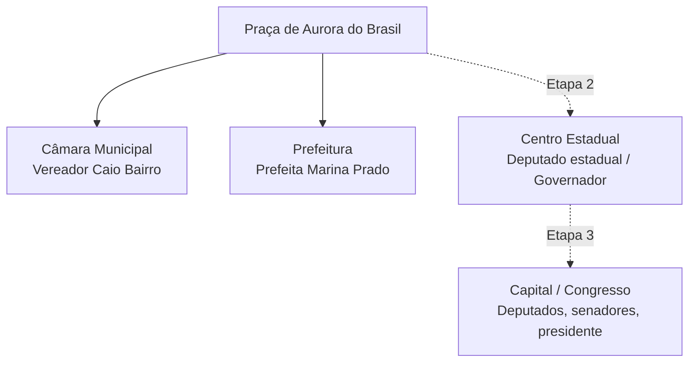
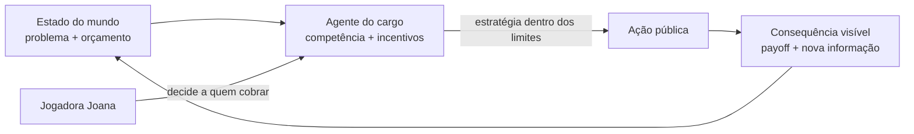

# Aurora: Quem Decide? — Documento de Game Design (GDD)

> **Status:** Protótipo / *vertical slice* jogável.
> **Gênero:** Aventura 2D *top-down* educativa (serious game).
> **Plataforma:** Desktop (Python 3 + Arcade `>=3.0,<4.0`).
> **Público:** Estudantes do ensino fundamental II / médio e público geral.
> **Propósito:** Ensinar a divisão de competências entre os cargos e níveis de
> governo brasileiros — de forma lúdica, fictícia e não partidária.

Este documento descreve o design do jogo usando os referenciais reunidos na pasta
de referências do projeto: MDA, as lentes de Schell, as Quatro Chaves da Diversão
de Lazzaro, a prototipagem de Fullerton e a definição de serious games. Complementa
o **game-design.md** (objetivo pedagógico, **Anexo A**) e o **resumo-projeto.md**
(visão geral, **Anexo B**), ambos reproduzidos na íntegra ao final deste documento.

---

## 1. Visão e pilar de design

**Frase-conceito:** *"Antes de cobrar, descubra quem decide."*

O jogo é, deliberadamente, um **protótipo** no sentido de Fullerton: ele existe
para provar uma hipótese antes de investir na produção completa.

> **Hipótese central do protótipo:** uma missão de *responsabilidade* (relacionar
> um problema ao nível de governo) somada a um sistema de **provas** ensina a
> divisão de competências melhor do que um texto expositivo — e o faz gerando
> *fiero* (o triunfo de "eu descobri quem decide").

**Pilar único:** toda mecânica deve levar o jogador a **raciocinar sobre
responsabilidade pública**. Se uma feature não serve a isso, fica fora do escopo
do protótipo.

---

## 2. Enquadramento MDA

Seguindo o **MDA Framework**, projetamos de baixo
para cima (mecânica → dinâmica → estética); o jogador experimenta de cima para
baixo.



| Camada | Em *Aurora: Quem Decide?* |
|--------|---------------------------|
| **Mecânicas** | Explorar top-down; conversar com NPCs; missão de múltipla escolha por nível de governo; coletar provas (problema/testemunho/lei); side quests; estrelas; Diário de Cidadania; salvar/configurar |
| **Dinâmicas** | Investigar antes de responder; cruzar testemunhos com o diário; deduzir o nível responsável; revisitar áreas para completar provas |
| **Estéticas** | **Descoberta** (primária), **Desafio**, **Narrativa**, **Expressão** cívica |

---

## 3. Estéticas-alvo e emoções (Quatro Chaves da Diversão)

Mapeamento das **Quatro Chaves de Lazzaro** sobre o vocabulário estético do MDA:

| Chave (Lazzaro) | Estética (MDA) | Emoção-alvo | Como o jogo entrega |
|-----------------|----------------|-------------|---------------------|
| **Serious Fun** *(primária)* | Submissão/Descoberta | propósito, "trabalho cívico" | aprender competências; provas e diário dão peso de trabalho real |
| **Easy Fun** | Descoberta | curiosidade, *wonder* | explorar Aurora, ouvir moradores, descobrir cargos |
| **Hard Fun** | Desafio | **fiero** | acertar o nível de governo responsável |
| **People Fun** | Camaradagem | calor humano | Discussão com outros jogadores |

**PX Spiral pretendida numa missão:** curiosidade (chego a um problema) →
investigação (ouço testemunhos, consulto o diário) → leve frustração/dúvida na
pergunta → **fiero** ao acertar → alívio → curiosidade pela próxima missão.

---

## 4. Mecânicas

### 4.1 Movimentação e exploração
- Top-down, com **mapeamento natural** (setas ou `WASD`), conforme o *game feel*
  de Swink (ver referência de Prototipagem).
- O **contexto espacial** dá sentido: cada prédio ancora um cargo (a Câmara ancora
  o vereador; a Prefeitura, a prefeita). Restrições do mapa organizam a jornada.

### 4.2 Diálogo e interação
- Interagir com NPCs (`E`/`Enter`) abre diálogos que apresentam o problema, a
  função do cargo e a pergunta da missão.

### 4.3 Missão de responsabilidade (mecânica-âncora)
- Cada missão apresenta um problema e pergunta **qual nível/cargo é responsável**,
  em múltipla escolha.
- Uma resposta certa e um feedback educativo são validados em regras testadas
  (ver `src/rules.py` e o teste `tests/test_mission_rules.py`).
- O feedback de erro **convida a raciocinar** ("pense no nível responsável por
  serviços da cidade"), não apenas sinaliza "errado".

### 4.4 Provas (valor endógeno)
- Cada missão reúne três provas: **problema**, **testemunho** e **lei**
  (`evidence_ids` em `src/content/missions.py`).
- As provas são o **valor endógeno** (Lente #5 de Schell): só valem dentro do
  jogo, mas medem o quanto o jogador se importa em **fundamentar** a resposta.

### 4.5 Side quests e testemunhos
- Um morador pede que o jogador ouça outros moradores; ao ouvir todos, ganha a
  prova `:testemunho` e uma **estrela** (`src/content/sidequests.py`).
- Reforçam a **participação social** como parte da decisão pública.

### 4.6 Diário de Cidadania
- Registro consultável do que cada cargo **faz** e **não faz**, com resumo por
  nível de governo. É a "memória externa" que sustenta a dedução.

### 4.7 Sistemas de suporte
- **Salvamento** em múltiplos slots (JSON) e **configurações** (áudio, tela
  cheia): `save_1.json` … / `settings.json`.

---

## 5. Regras

1. **Uma missão = uma pergunta de responsabilidade.** O acerto exige identificar o
   nível/cargo correto (Executivo x Legislativo; Município x Estado x União).
2. **Errar não pune com game over.** O jogo devolve uma dica que reformula o
   raciocínio; o jogador tenta de novo (aprendizado por tentativa **informada**).
3. **Provas embasam, não substituem, o raciocínio.** Coletar as três provas dá
   contexto e estrela, mas a resposta ainda exige decisão do jogador.
4. **Progressão por níveis de governo.** Etapa 1 (Município) → Etapa 2 (Estado) →
   Etapa 3 (União); cada etapa introduz novos cargos.
5. **Distinção de poderes é regra de conteúdo.** Legislativo cria leis e fiscaliza;
   Executivo administra e executa — presente em todo feedback.
6. **Fidelidade cívica.** Conteúdo revisado por fontes oficiais; nada de partido,
   pedido de voto ou evento real (princípio de serious game confiável).

---

## 6. Espaços (o mundo)

Seguindo o mapa de interesse de Schell, os espaços do jogo são organizados para
que **o lugar ensine**: cada ambiente materializa um nível de governo.



| Espaço | Nível | Função dramática e pedagógica |
|--------|-------|-------------------------------|
| **Praça** | — | *hub* inicial; onde a comunidade reclama e a curiosidade nasce |
| **Câmara Municipal** | Municipal | Legislativo local: propor leis e fiscalizar |
| **Prefeitura** | Municipal | Executivo local: executar serviços e orçamento |
| **Centro Estadual** | Estadual | Hospitais de referência, rodovias, segurança |
| **Capital / Congresso** | Federal | Leis nacionais; Câmara x Senado; presidência |
| **Interiores** | — | ambientes internos (`src/world/interiors.py`) |

A cidade é o "**sistema formal fechado**" (círculo mágico): dentro dela, provas e
estrelas têm valor; cada bairro é um recorte de um problema público real.

---

## 7. Sensações (game feel e estética sensorial)

Com base na referência de Prototipagem / Game Feel:

- **Input:** resposta imediata e previsível ao teclado (mapeamento natural).
- **Response:** feedback claro em diálogos e na resolução da missão.
- **Context:** o espaço urbano dá sentido ao movimento — andar até a Prefeitura
  é, em si, um argumento ("é aqui que se executa").
- **Polish/Áudio:** música e efeitos gerenciados por `src/audio.py`;
  o jogo **funciona sem áudio externo** (decisão econômica de protótipo).
- **Metáfora:** a cidade fictícia de Aurora do Brasil é a metáfora segura para
  discutir instituições reais sem citá-las.
- **Sensação-alvo dominante:** a virada de **dúvida → clareza** ("agora sei quem
  decide"), que é o momento de *fiero* do jogo.

---

## 8. Narrativa

**Logline:** Joana muda-se para Aurora do Brasil, percebe que todos reclamam mas
ninguém sabe **quem** resolve cada problema, e decide entender a política de
verdade conversando com quem ocupa cada cargo.

**Arco em três atos** (níveis de governo como estrutura dramática):

1. **O Município** — problemas perto de casa (saúde no bairro, orçamento, praça).
   Joana aprende vereador e prefeito.
2. **O Estado** — problemas grandes demais para um município (hospital regional,
   rodovia). Deputado estadual e governador.
3. **A União** — leis para todo o país. Deputados federais, senadores, presidente.

**Encerramento:** Joana conclui que decisões públicas dependem de **competência,
orçamento, leis e participação** — e passa a saber a quem cobrar cada assunto.

A narrativa é **tecida, não pregada** (princípio de serious game): o conteúdo cívico
emerge das missões e dos testemunhos, não de aulas expositivas. Personagens e
falas são **fictícios**.

---

## 9. Conceitos pedagógicos (o "sério" do serious game)

Fundamentado na referência de Serious Games.

**Objetivos de aprendizagem** — ao fim de cada capítulo, o jogador deve:
1. **Relacionar** um problema ao nível de governo responsável.
2. **Explicar** ao menos uma atribuição do cargo.
3. **Distinguir** Legislativo (legislar/fiscalizar) de Executivo (administrar/executar).
4. Reconhecer que **políticas públicas envolvem escolhas, limites e consequências**.

**Alinhamento ODS:** ODS 4 (Educação de Qualidade) e ODS 16 (Instituições
Eficazes) como centrais; ODS 11 e 17 como temáticos (ver **Anexo B**).

---

## 10. Plano de playtesting

Aplicando as cinco perguntas de Schell (referência de Playtesting):

| Pergunta | Decisão para o protótipo |
|----------|--------------------------|
| **Por quê?** | O jogador entende que deve descobrir o *nível de governo*? Acerta por dedução ou por tentativa e erro? As provas parecem valiosas? Consegue **explicar uma atribuição** depois? |
| **Quem?** | Colegas *tissue testers* (olhos frescos); depois, estudantes do público-alvo |
| **Onde?** | Laboratório da USP; presencial para observar rostos |
| **O quê?** | Momentos de dúvida na múltipla escolha (esperado) + surpresas (o que confunde ou encanta) |
| **Como?** | Observar **rostos**, não só a tela; entrevista curta pós-jogo; pedir "as 3 coisas menos claras" |

**Métrica de sucesso do protótipo:** ≥ maioria dos testadores consegue, sem
ajuda, relacionar o problema ao nível correto **e** justificar com uma atribuição.

---

## 11. Escopo e próximos passos

**No protótipo (agora):** Etapa 1 — praça, Câmara e Prefeitura; missão da unidade
de saúde; provas; side quest; diário; salvar/configurar.

**Próximas iterações** (após validar a hipótese em playtest):
1. Vereador — analisar proposta de lei local e fiscalizar execução.
2. Prefeito — equilibrar orçamento entre saúde, transporte e educação.
3. Estado — hospital regional e estrada estadual.
4. União — comparar Câmara e Senado no processo legislativo.
5. Presidente — executar políticas federais respeitando leis e orçamento.

Cada iteração deve manter o **pilar único** (raciocinar sobre responsabilidade) e
passar por um novo ciclo de playtesting antes de expandir.

---

## 12. Agentes estratégicos e teoria dos jogos

Além do referencial de *game design* (seções anteriores), o jogo se apoia na
**teoria dos jogos** (*game theory*) — o estudo da **decisão estratégica entre
agentes** cujas escolhas se influenciam mutuamente. Isso não é acaso temático: a
própria política pública é um sistema de agentes com **competências, orçamentos e
interesses** que precisam decidir sob restrições. Modelar o conteúdo cívico como
um jogo de agentes torna o aprendizado mais fiel e mais interessante.

### 12.1 Conceitos e o mapeamento cívico

| Conceito da teoria dos jogos | No mundo real | Em *Aurora: Quem Decide?* |
|------------------------------|---------------|---------------------------|
| **Agente / jogador** | Cargo ou nível de governo com poder de decisão | Vereador, prefeito, governador, presidente e a **cidadã Joana** |
| **Estratégia** | Curso de ação disponível ao agente (legislar, executar, fiscalizar, cooperar) | Escolhas de missão e de alocação (ex.: orçamento) |
| **Payoff (recompensa)** | Serviço entregue, aprovação social, orçamento equilibrado | Provas, estrelas e feedback educativo |
| **Restrições / regras do jogo** | Constituição, competências, orçamento | Regras de conteúdo (Legislativo x Executivo; níveis de governo) |
| **Informação** | O cidadão raramente sabe "quem decide" — **informação assimétrica** | O jogo transforma a *descoberta* de informação na mecânica central |
| **Cooperação x competição** | Municípios, estados e União precisam cooperar (federalismo) | Missões que exigem coordenação entre níveis (ODS 17) |
| **Ação coletiva / bem comum** | Serviços públicos são **bens comuns**; ninguém sozinho os provê | Testemunhos mostram o custo coletivo de não decidir |

### 12.2 Agentes estratégicos como base para NPCs

Hoje os NPCs são **roteirizados** (falas fixas). A teoria dos jogos oferece o
caminho para torná-los **agentes estratégicos**: personagens que "decidem" segundo
os incentivos e limites do seu cargo. Isso liga-se ao **MDA**
(citado no próprio artigo): *não existe "mecânica de IA" isolada — a inteligência
emerge da interação da lógica do agente com a lógica de jogo*.



### 12.3 Dilemas estratégicos como conteúdo pedagógico

Situações clássicas da teoria dos jogos viram **missões**:

- **Dilema do orçamento (soma limitada):** saúde, transporte e educação disputam
  o mesmo recurso — escolher um implica abrir mão de outro (*trade-off*). Ensina
  que "política pública envolve escolhas, limites e consequências".
- **Problema de ação coletiva:** um serviço só se viabiliza se vários agentes
  cooperarem (município + estado). Reforça o **ODS 17** (parcerias).
- **Assimetria de informação:** o payoff do cidadão melhora quando ele **descobre
  quem decide** — o que é, literalmente, o pilar do jogo.

> **Limite de escopo:** no protótipo, a estratégia dos NPCs é **implícita** (falas
> que expõem incentivos e limites do cargo). A modelagem explícita de agentes
> (payoffs numéricos, decisões emergentes) é uma **oportunidade de design** —
> tratada na seção 13.

---

## 13. Oportunidades de design a explorar

Backlog de evoluções para investigar em próximas iterações. Cada item traz uma
**pergunta de protótipo** (Fullerton) e a **estética-alvo** (MDA/Lazzaro), para
que só invistamos após validar a hipótese em playtesting. Prioridade: 🟢 alta ·
🟡 média · 🔵 exploratória.

### 13.1 Agentes e simulação
- 🟡 **NPCs como agentes estratégicos** — cargos que "decidem" segundo incentivos
  e limites, tornando o mundo reativo. *Pergunta:* decisões emergentes ensinam
  melhor que falas fixas? *Estética:* Descoberta + Desafio.
- 🔵 **Simulação de orçamento** — alocar recursos e ver consequências ao longo do
  tempo (feedback à la Monopoly citado no MDA). *Estética:* Serious Fun (trabalho
  real) + Desafio.

### 13.2 Profundidade de decisão
- 🟢 **Dilema de orçamento jogável** (seção 12.3) — primeiro *trade-off* explícito
  do jogo. *Pergunta:* o jogador percebe o custo de oportunidade? *Estética:*
  Desafio, *fiero*.
- 🟡 **Missões de cooperação entre níveis** — objetivo que exige coordenar
  município + estado (ODS 17). *Estética:* Camaradagem/People Fun.
- 🔵 **Ramos de consequência** — respostas mudam o estado da cidade em missões
  futuras (continuidade narrativa). *Estética:* Narrativa.

### 13.3 Engajamento e emoção (Quatro Chaves)
- 🟡 **People Fun em sala** — modo de discussão/comparação de respostas entre
  colegas após jogar. *Estética:* Camaradagem.
- 🔵 **Easy Fun ampliado** — segredos e testemunhos opcionais que premiam
  exploração. *Estética:* Curiosidade/*wonder*.
- 🟢 **Reforço do *fiero*** — feedback de acerto mais expressivo (áudio/visual)
  no momento "descobri quem decide". *Estética:* Hard Fun.

### 13.4 Aprendizagem e avaliação
- 🟢 **Diário como avaliação formativa** — quiz de fechamento por etapa que checa
  os objetivos de aprendizagem (relacionar, explicar, distinguir). *Estética:*
  Serious Fun.
- 🟡 **Painel de progresso cívico** — visualização do que o jogador domina por
  nível de governo. *Estética:* Serious Fun (valor endógeno).
- 🔵 **Acessibilidade** — legendas, alto contraste, remapeamento de teclas;
  amplia o alcance educativo (público de serious game).

### 13.5 Conteúdo e escala
- 🟡 **Novos cargos e etapas** (Estado e União) conforme a seção 11.
- 🔵 **Editor de missões orientado a dados** — usar as `dataclass` de
  `src/content/` para autoria sem mexer no código-fonte.
- 🔵 **Atualização com data e fontes oficiais** — exibir a data de revisão do
  conteúdo cívico (princípio editorial de serious game confiável).

> **Regra de priorização:** toda oportunidade deve servir ao **pilar único**
> (raciocinar sobre responsabilidade pública) e passar por playtesting antes de
> virar produção — coerente com a abordagem de protótipo de Fullerton.

---

# Anexo A — Design e objetivo pedagógico

> Reprodução integral do documento `docs/game-design.md`, incluído aqui como anexo
> para leitura impressa.

## Objetivo pedagógico

Ensinar, de forma interativa, as atribuições e os limites de vereador, prefeito,
deputado estadual, governador, deputado federal, senador e presidente. O jogo
também apresenta orçamento, fiscalização, participação social e cooperação entre
níveis de governo.

## Princípios editoriais

- Personagens, nomes, vozes e falas são fictícios.
- Não há partido, pedido de voto ou reprodução de evento político real.
- Toda missão informa o nível de governo relacionado ao problema.
- O conteúdo será revisado com fontes oficiais e exibirá a data de atualização.
- O jogo deve mostrar que políticas públicas envolvem escolhas, limites e consequências.

## Vertical slice atual

A protagonista explora uma praça de Aurora do Brasil e conversa com o vereador Caio
Bairro e a prefeita Marina Prado. Ao falar com o vereador, recebe uma missão sobre
uma unidade de saúde. A resposta correta identifica a prefeitura como responsável
pela execução municipal e a Câmara como órgão de legislação e fiscalização local.

## Próximas missões

1. Vereador: analisar uma proposta de lei local e fiscalizar sua execução.
2. Prefeito: equilibrar orçamento municipal entre saúde, transporte e educação.
3. Deputado estadual e governador: decidir sobre hospital regional e estrada estadual.
4. Deputado federal e senador: comparar Câmara e Senado no processo legislativo.
5. Presidente: executar políticas federais respeitando leis e orçamento aprovados.

## Critério de aprendizagem

Ao final de cada capítulo, o jogador deve relacionar corretamente um problema ao
nível de governo e explicar uma atribuição do cargo envolvido.

---

# Anexo B — Resumo do Projeto

> Reprodução integral do documento `docs/resumo-projeto.md`, incluído aqui como
> anexo para leitura impressa.

Jogo 2D educativo sobre educação política e cidadania, desenvolvido em Python com a
biblioteca Arcade. Personagens e acontecimentos são fictícios. Conteúdo educativo e
não partidário.

## B.1 Resumo do jogo

**Aurora: Quem Decide?** é um jogo 2D *top-down* de educação política. O jogador
acompanha Joana, uma personagem que acabou de se mudar para a cidade fictícia de
**Aurora do Brasil** e percebe que muita gente reclama de problemas locais, mas
quase ninguém sabe **quem** tem o poder de resolver cada um deles.

Explorando a cidade, Joana conversa com quem ocupa cada cargo público, recebe
missões e aprende, na prática, as atribuições e os limites de vereador, prefeito,
deputado estadual, governador, deputado federal, senador e presidente.

O jogo está estruturado em três etapas que acompanham os níveis de governo:

| Etapa | Nível | Foco |
|-------|-------|------|
| 1 — O Município | Municipal | Serviços locais do dia a dia: saúde básica, escolas municipais, transporte urbano |
| 2 — O Estado | Estadual | Ações regionais: hospitais de referência, rodovias estaduais, segurança pública |
| 3 — A União | Federal | Assuntos nacionais: leis federais, políticas do país, relações entre os estados |

### Mecânicas principais

- **Movimentação e exploração** *top-down* pela cidade (setas ou `WASD`).
- **Diálogos e missões** com NPCs que representam cargos públicos; cada missão
  apresenta um problema e pergunta de múltipla escolha sobre **qual nível de
  governo é responsável**.
- **Side quests** com moradores: ouvir testemunhos da comunidade concede provas e
  estrelas, reforçando a participação social como parte da decisão pública.
- **Diário de Cidadania**: registro consultável com a descrição do que cada cargo
  *faz* e o que *não faz*, além de um resumo por nível de governo.
- **Sistema de provas** (problema, testemunho e lei) que embasa a resposta correta
  de cada missão.
- Sistema de **salvamento** (múltiplos slots) e **configurações** (áudio, tela cheia).

### Enredo em síntese

Ao percorrer os três níveis de governo, Joana entende que decisões públicas dependem
de **competência, orçamento, leis e participação** — e passa a saber a quem cobrar
cada assunto.

## B.2 Objetivos

### Objetivo pedagógico

Ensinar, de forma interativa, as **atribuições e os limites** dos cargos eletivos
brasileiros (vereador, prefeito, deputado estadual, governador, deputado federal,
senador e presidente), apresentando também orçamento público, fiscalização,
participação social e cooperação entre os níveis de governo.

### Objetivos de aprendizagem

Ao final de cada capítulo, o jogador deve ser capaz de:

1. **Relacionar** corretamente um problema ao nível de governo responsável (município, estado ou União).
2. **Explicar** ao menos uma atribuição do cargo envolvido.
3. **Distinguir** os papéis do Legislativo (criar leis e fiscalizar) e do Executivo (administrar e executar).
4. Reconhecer que **políticas públicas envolvem escolhas, limites e consequências**, dentro da lei e do orçamento.

### Princípios editoriais

- Personagens, nomes, vozes e falas são **fictícios**.
- Não há partido, pedido de voto ou reprodução de evento político real.
- Toda missão informa o **nível de governo** relacionado ao problema.
- O conteúdo deve ser revisado com fontes oficiais e exibir a data de atualização.

## B.3 Ligação e justificativa frente aos ODS

O jogo dialoga diretamente com a **Agenda 2030** da ONU e seus **Objetivos de
Desenvolvimento Sustentável (ODS)**. A educação política e cidadã é uma alavanca
transversal: cidadãos que entendem "quem decide o quê" fiscalizam melhor, participam
mais e cobram políticas públicas eficazes — condição para o avanço de praticamente
todos os ODS.

### ODS diretamente contemplados

- **ODS 16 — Paz, Justiça e Instituições Eficazes** *(central)*
  Meta **16.6** (instituições eficazes, responsáveis e transparentes) e **16.7**
  (tomada de decisão responsiva, inclusiva e participativa). O jogo ensina como as
  instituições funcionam, o papel da fiscalização e da prestação de contas, e como a
  participação social influencia a decisão pública.

- **ODS 4 — Educação de Qualidade** *(central)*
  Meta **4.7**, que trata de assegurar que os estudantes adquiram conhecimentos para
  promover a **cidadania global e o desenvolvimento sustentável**. O jogo é, em si,
  uma ferramenta de educação cidadã interativa.

- **ODS 11 — Cidades e Comunidades Sustentáveis**
  Meta **11.3** (urbanização inclusiva e participativa e gestão participativa). As
  missões giram em torno de problemas urbanos concretos (saúde no bairro, praça,
  transporte, orçamento municipal) e de como a comunidade participa das decisões da cidade.

- **ODS 17 — Parcerias e Meios de Implementação**
  A narrativa reforça a **cooperação entre níveis de governo** (município, estado e
  União) para resolver problemas que ultrapassam uma única fronteira administrativa.

### ODS contemplados de forma temática (pano de fundo das missões)

- **ODS 3 — Saúde e Bem-Estar**: missões sobre unidade de saúde no bairro e hospital regional.
- **ODS 10 — Redução das Desigualdades**: testemunhos da comunidade destacam acesso a serviços públicos como questão de dignidade e igualdade.
- **ODS 9 — Indústria, Inovação e Infraestrutura**: missões sobre rodovias e infraestrutura estadual.

### Justificativa

A baixa compreensão sobre a divisão de competências entre os poderes e os níveis de
governo enfraquece o controle social e a qualidade da democracia. Ao transformar
esse conteúdo em uma experiência lúdica, acessível e não partidária, o projeto
contribui para **formar cidadãos capazes de identificar responsabilidades, cobrar de
forma correta e participar** — exatamente o tipo de capital cívico que sustenta
instituições eficazes (ODS 16) e o alcance dos demais objetivos da Agenda 2030.

## B.4 Tecnologias utilizadas

### Linguagem e bibliotecas

- **Python 3** — linguagem principal do projeto.
- **Arcade `>=3.0,<4.0`** (https://api.arcade.academy/) — biblioteca de jogos 2D
  (janela, renderização, sprites, entrada de teclado, áudio e sistema de *views*).
- **pytest `>=8.0,<9.0`** (https://docs.pytest.org/) — testes automatizados
  (ex.: `tests/test_mission_rules.py`).

### Organização do código (`src/`)

| Módulo | Responsabilidade |
|--------|------------------|
| `main.py` | Ponto de entrada; cria a janela e carrega o menu principal |
| `config.py` | Constantes de tela, mapa, física e paleta de cores |
| `assets.py` / `modular.py` / `citytiles.py` | Carregamento e composição de sprites e tiles |
| `audio.py` | Gerenciamento de som e música |
| `rules.py` | Regras/validação das missões |
| `save_manager.py` | Salvamento em JSON e configurações |
| `ui.py` | Componentes de interface |
| `content/` | Conteúdo educativo: `missions.py`, `roles.py`, `problems.py`, `sidequests.py` |
| `views/` | Telas do jogo: menu, novo jogo, mundo, diário, pausa, créditos, etc. |
| `world/` | Ambientes internos (`interiors.py`) |

### Assets

- **Kenney** (https://kenney.nl/) — pacotes gráficos sob licença **Creative Commons
  Zero (CC0 1.0)**: Pixel Vehicle Pack, Roguelike Modern City, Roguelike Characters,
  Modular Characters, Tiny Town e UI Pack. Todos registrados em `docs/asset-registry.md`.
- O jogo **funciona sem assets externos de áudio**; sons/músicas licenciados (Envato)
  só devem ser adicionados após o registro em `docs/asset-registry.md`.

### Ferramentas e armazenamento

- **`saves/`** — progresso e configurações persistidos em **JSON**.
- **`tools/check_envato.py`** — verifica apenas a conectividade pública com o Envato (sem login/scraping).
- **`.venv`** — ambiente virtual Python isolado.

### Como executar

```powershell
python -m venv .venv
.\.venv\Scripts\Activate.ps1
python -m pip install -r requirements.txt
python -m src.main
```

Controles: setas ou `WASD` (mover), `E`/`Enter` (interagir), `M` (áudio), `Esc` (sair).

## B.5 Referências

### Documentação técnica

- Python Arcade — Documentação oficial: https://api.arcade.academy/
- pytest — Documentação oficial: https://docs.pytest.org/
- Python — Documentação oficial: https://docs.python.org/3/

### Assets

- Kenney — Biblioteca de assets CC0: https://kenney.nl/
- Creative Commons Zero (CC0 1.0): https://creativecommons.org/publicdomain/zero/1.0/

### Objetivos de Desenvolvimento Sustentável (ODS)

- ONU — Agenda 2030 e os 17 ODS: https://brasil.un.org/pt-br/sdgs
- ODS 4 (Educação de Qualidade): https://brasil.un.org/pt-br/sdgs/4
- ODS 11 (Cidades e Comunidades Sustentáveis): https://brasil.un.org/pt-br/sdgs/11
- ODS 16 (Paz, Justiça e Instituições Eficazes): https://brasil.un.org/pt-br/sdgs/16
- ODS 17 (Parcerias e Meios de Implementação): https://brasil.un.org/pt-br/sdgs/17

### Conteúdo cívico (fontes oficiais sugeridas para revisão)

- Constituição da República Federativa do Brasil de 1988: https://www.planalto.gov.br/ccivil_03/constituicao/constituicao.htm
- Câmara dos Deputados — Portal: https://www.camara.leg.br/
- Senado Federal — Portal: https://www12.senado.leg.br/

### Documentos internos do projeto

- `docs/game-design-document.md` — Documento de Game Design (GDD) completo (este documento)
- `docs/game-design.md` — Design e objetivo pedagógico (reproduzido no Anexo A)
- `docs/referencias/` — Referências acadêmicas de game design
- `docs/asset-registry.md` — Registro e licenças dos assets
- `README.md` — Instruções de execução

---

*Documento de design do projeto acadêmico (USP). Conteúdo educativo, fictício e
não partidário. Referências acadêmicas registradas na pasta de referências do projeto.*
