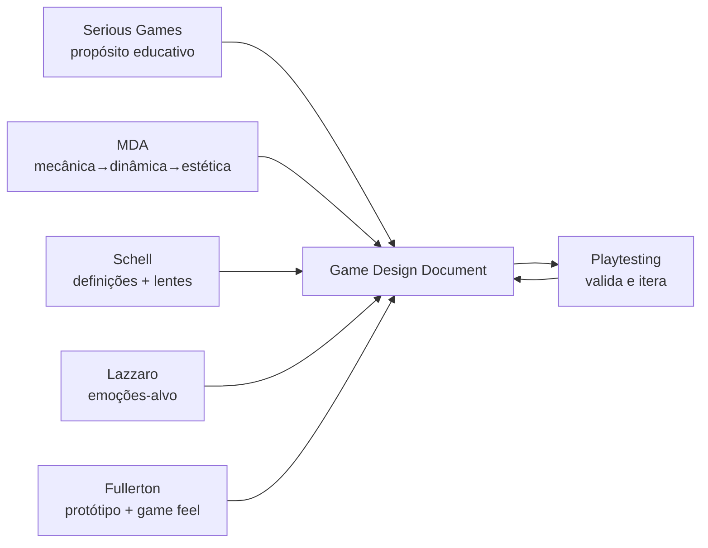

# Referências de Game Design

Esta pasta reúne os artigos e capítulos acadêmicos que fundamentam o design de
**Aurora: Quem Decide?**. Cada arquivo resume uma fonte, destaca seus conceitos
centrais e registra **como aplicamos aquele referencial no nosso protótipo**.

> Os PDFs originais são material de estudo do grupo. Estas notas servem como
> índice consultável e ponte entre a teoria e as decisões de design registradas
> em [../game-design-document.md](../game-design-document.md).

## Índice

| # | Nota | Fonte original | Uso no projeto |
|---|------|----------------|----------------|
| 01 | [MDA Framework](01-mda-framework.md) | Hunicke, LeBlanc & Zubek — *MDA: A Formal Approach to Game Design and Game Research* | Estruturar Mecânicas → Dinâmicas → Estéticas |
| 02 | [A Experiência e o Jogo](02-schell-experiencia-e-jogo.md) | Schell — *The Art of Game Design*, cap. 3 | Definir o que é jogo/diversão e desenhar a experiência |
| 03 | [Playtesting](03-schell-playtesting.md) | Schell — *The Art of Game Design*, cap. 25 | Plano de testes com jogadores (as 5 perguntas) |
| 04 | [Prototipagem](04-fullerton-prototipagem.md) | Fullerton — *Game Design Workshop* (Gingold; Swink) | Justificar o "jogo como protótipo" e game feel |
| 05 | [As Quatro Chaves da Diversão](05-lazzaro-four-fun-keys.md) | Lazzaro — *Game Usability*, cap. 20 | Mapear emoções-alvo (Hard/Easy/Serious/People Fun) |
| 06 | [Serious Games](06-serious-games.md) | *Serious Games: Games That Educate, Train, and Inform*, cap. 2 | Fundamentar o propósito educativo sem perder o jogo |

## Como estas notas alimentam o design

